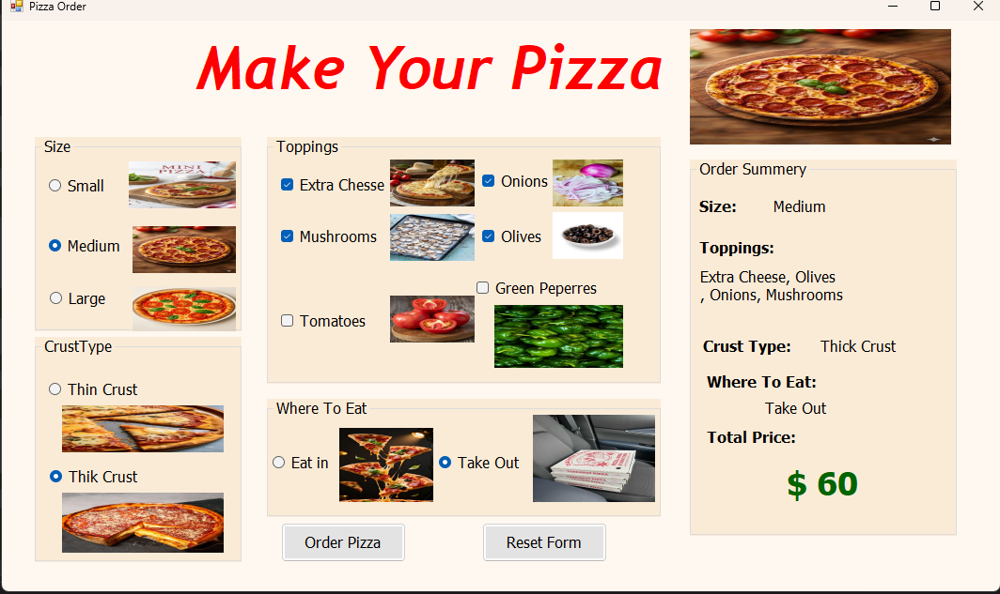

# 🍕 Pizza Order System — Windows Forms (C#)

## 📸 Preview

### 🖥️ Application UI



---

## 📖 Overview

This project is a **Pizza Ordering System** built using **C# and Windows Forms**.

It allows users to fully customize their pizza by selecting:

* Size (Small / Medium / Large)
* Crust type (Thin / Thick)
* Multiple toppings
* Dining option (Eat In / Take Out)

The application dynamically updates the **order summary and total price in real-time**, providing a smooth and interactive user experience.

---

## 🎯 Learning Purpose

This project helped me practice:

* Event-driven programming (WinForms)
* Managing UI state and user interactions
* Separating logic from UI (clean architecture)
* Using `Tag` property to store prices
* Building dynamic calculation systems

---

## ⚙️ Features

### 🧩 Full Pizza Customization

* Choose pizza size with visual preview
* Select crust type
* Add/remove multiple toppings

---

### 💰 Real-Time Price Calculation

* Prices stored inside controls using `Tag`
* Total updates instantly with every change

---

### 🧾 Live Order Summary

Displays:

* Selected size
* Toppings list
* Crust type
* Dining method
* Total price

---

### 🔄 Reset Function

* Clears all selections
* Restores default state

---

### ✅ Order Confirmation

* Confirmation dialog before placing order
* Disables inputs after successful order

---

## 🧪 Edge Cases Handled

* No toppings selected → shows "No Toppings"
* Multiple toppings handled dynamically
* Prevents inconsistent UI after order

---

## 🎨 UI Highlights

* Clean layout using GroupBoxes
* Images for better user experience
* Soft background color for modern look
* Organized summary panel

---

## 🔧 Technologies Used

* 💻 C# (.NET Framework)
* 🪟 Windows Forms (WinForms)
* 🎯 Event-driven architecture

---

## 🧩 Project Structure

```id="x2k9qp"
📂 PizzaProject
┣ 📁 assets
┃ ┗ pizza-ui.png
┣ 📄 Form1.cs
┣ 📄 Form1.Designer.cs
┣ 📄 Program.cs
┗ 📄 App.config
```

---

## 🚀 How to Run

1. Open the project in **Visual Studio**
2. Build the solution
3. Press **F5**
4. Start ordering your pizza 🍕

---

## 📌 Future Improvements

* Add quantity selection
* Add order history
* Improve UI with modern styling
* Add animations
* Export invoice / receipt

---

## 💬 Final Thought

This project reflects the transition from writing simple code
to building a **real interactive desktop application**.

> “User experience + clean logic = great software.”

---

## 🔗 Clone Repository

```bash id="k8p3md"
git clone https://github.com/MohamadTawelah/PizzaProject
```
